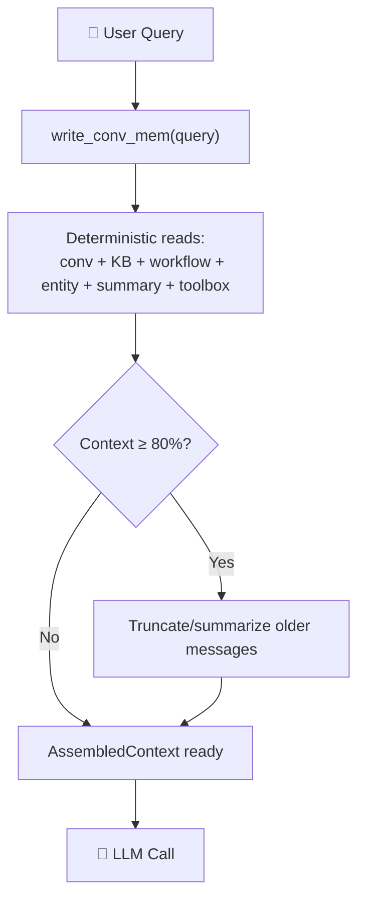

# Context Assembly Agent

The `ContextAssemblyAgent` is the **core meta-agent** — it implements the BEFORE-loop pattern from the agent memory course (Lesson 06). Its job is to assemble all relevant memory context before each LLM call.

## Why This Matters

From the course:

> "Chicken-and-egg problem: the agent can't decide to check memory it doesn't know exists. You need deterministic retrieval at the start."

The Context Assembly Agent solves this by **always** running before the LLM, loading all relevant context deterministically.

## The BEFORE-Loop Pattern



## Usage

```python
from memharness import MemoryHarness
from memharness.agents import ContextAssemblyAgent

harness = MemoryHarness("sqlite:///memory.db")
await harness.connect()

agent = ContextAssemblyAgent(
    harness=harness,
    max_tokens=4000,
    summarize_threshold=0.8,  # 80% — trigger truncation
)

ctx = await agent.assemble(
    query="How do I deploy to Kubernetes?",
    thread_id="user-123",
    include_tools=True,
)

print(f"Context usage: {ctx.context_usage_percent:.1%}")
print(f"Estimated tokens: {ctx.total_tokens_estimate}")
```

## AssembledContext

The `assemble()` method returns an `AssembledContext` dataclass:

### Fields

| Field | Type | Content |
|-------|------|---------|
| `persona` | `str` | Agent identity/style |
| `conversation_history` | `list[MemoryUnit]` | Recent messages from thread |
| `knowledge` | `str` | Relevant KB entries |
| `workflows` | `str` | Matching workflow patterns |
| `entities` | `str` | Known entities |
| `summaries` | `str` | Compressed summaries |
| `tools` | `str` | Toolbox tree |
| `user_query` | `str` | Current query |
| `total_tokens_estimate` | `int` | Rough token count |
| `context_usage_percent` | `float` | 0.0 to 1.0 |

### Two Output Formats

```python
# 1. Markdown string — for direct LLM prompting
prompt = ctx.to_prompt()
# Returns sectioned markdown:
# ## Agent Persona
# ## Conversation History
# ## Relevant Knowledge
# ...

# 2. LangChain messages — for any LLM provider
messages = ctx.to_messages()
# Returns list[BaseMessage]:
# [SystemMessage(content="## Agent Persona\n..."),
#  HumanMessage(content="Hello!"),
#  AIMessage(content="Hi there!"),
#  ...]
```

## Context Window Monitor

The agent monitors context usage and warns when approaching limits:

- **below 80%** — normal, return all context
- **80%+** — truncate older conversation history to last 10 messages

```python
ctx = await agent.assemble(query="...", thread_id="...")

if ctx.context_usage_percent > 0.8:
    print("⚠️ Context nearly full — consider running Summarizer Agent")
elif ctx.context_usage_percent > 0.5:
    print("⚡ Context at 50% — monitor closely")
else:
    print("✅ Context healthy")
```

## What Gets Loaded

All reads are **deterministic** — they always happen, regardless of content:

| Memory Type | Method | k |
|-------------|--------|---|
| Persona | `get_active_persona()` | 1 |
| Conversation | `get_conversational(thread_id, limit=20)` | 20 |
| Knowledge | `search_knowledge(query, k=5)` | 5 |
| Workflow | `search_workflow(query, k=3)` | 3 |
| Entity | `search_entity(query, k=5)` | 5 |
| Toolbox | `toolbox_tree("/")` | all |

## Integration with the Agent Loop

```python
async def call_agent(query: str, thread_id: str, llm):
    # BEFORE loop: deterministic context assembly
    ctx = await context_agent.assemble(query, thread_id)
    messages = ctx.to_messages()

    # INSIDE loop: LLM reasoning + tool calls
    response = await llm.invoke(messages)

    # AFTER loop: persist artifacts
    await harness.add_conversational(thread_id, "assistant", response.content)
    # (workflow + entity extraction via agents)

    return response.content
```

This is the complete BEFORE/INSIDE/AFTER pattern from Lesson 06 of the agent memory course.
