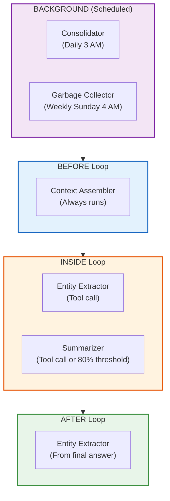

# Embedded Agents Overview

Embedded agents are autonomous, AI-powered processes that manage memory operations within memharness. They handle complex tasks like entity extraction, summarization, consolidation, and context assembly — operations that require semantic understanding beyond simple heuristics.

## What Are Memory Agents?

> **Memory Agents** = Small, specialized LLM-powered processes embedded INSIDE your memory infrastructure that autonomously perform memory management tasks.

They're called "embedded" because they live within the memharness system itself, not in your application code. Think of them as automated janitors, librarians, and curators working behind the scenes.

## The 5 Embedded Agents

memharness provides 5 specialized agents:

| Agent | Purpose | Mode | Example |
|-------|---------|------|---------|
| **Summarizer** | Compress old conversations | Heuristic + LLM | 30 messages → 1 paragraph |
| **Entity Extractor** | Extract people, places, orgs | Regex + LLM | "Dr. Chen works at MIT" → 2 entities |
| **Consolidator** | Merge duplicate memories | Semantic + LLM | 3 "Dr. Chen" entries → 1 merged entity |
| **Garbage Collector** | Clean expired memories | Policy-based | Delete memories older than 365d |
| **Context Assembler** | Build optimal LLM context | Retrieval + ranking | Assemble top-K from each memory type |

## Dual-Mode Design

All agents follow a **dual-mode design pattern**:

1. **Without LLM** — Uses heuristics, regex, or policy rules. Works immediately, no setup required.
2. **With LLM** — Uses LangChain for intelligent operations. Better quality, requires LLM configuration.

```python
from memharness import MemoryHarness
from memharness.agents import EntityExtractorAgent
from langchain.chat_models import init_chat_model

# Mode 1: Without LLM (heuristic)
harness = MemoryHarness("sqlite:///memory.db")
agent = EntityExtractorAgent(harness)  # No LLM
entities = await agent.extract_entities("Dr. Chen works at MIT")
# Uses regex: capitalized words, @mentions, email addresses

# Mode 2: With LLM (intelligent)
llm = init_chat_model("gpt-4o")
agent = EntityExtractorAgent(harness, llm=llm)
entities = await agent.extract_entities("Dr. Chen works at MIT")
# Uses LangChain structured output for accurate NER
```

## Agent Lifecycle: Triggers

Agents can be triggered in different ways:

| Trigger Type | When It Fires | Example |
|--------------|--------------|---------|
| **ON_WRITE** | When new memory is added | Entity extraction on every message |
| **ON_READ** | When memory is retrieved | Context assembly before LLM call |
| **PRE_LLM** | Before sending context to LLM | Context optimization |
| **POST_LLM** | After receiving LLM response | Extract entities from response |
| **SCHEDULED** | Time-based periodic execution | Daily consolidation at 3 AM |
| **POLICY** | Triggered by policy rules | GC when storage > 90% |
| **ON_DEMAND** | Manual invocation | User calls `agent.run()` |

## The BaseMemoryAgent Protocol

All agents implement the same interface:

```python
from memharness.agents.base import BaseMemoryAgent

class MyAgent(BaseMemoryAgent):
    def __init__(self, harness: MemoryHarness, llm: BaseChatModel | None = None):
        self.harness = harness
        self.llm = llm

    async def run(self, **kwargs) -> dict[str, Any]:
        """Execute the agent's main logic."""
        if not self.llm:
            return await self._heuristic_mode(**kwargs)
        return await self._llm_mode(**kwargs)
```

This consistent interface makes agents composable, testable, and framework-agnostic.

## BEFORE / INSIDE / AFTER the Loop

Agents operate at different points in the agent execution lifecycle:



## Why Embedded Agents?

| Without Agents | With Agents |
|---|---|
| Manual memory management | Automated memory operations |
| Write extraction logic in your app | Agents handle it internally |
| Context assembly is your problem | Context Assembler does it for you |
| No deduplication → messy memory | Consolidator keeps it clean |
| Memory grows forever → DB bloat | GC agent cleans expired memories |
| Inconsistent behavior across projects | Standardized, battle-tested agents |

## Configuration

Agents can be configured via YAML:

```yaml
agents:
  entity_extractor:
    enabled: true
    trigger: on_write
    llm: gpt-4o-mini

  summarizer:
    enabled: true
    triggers:
      - condition: "age > 7d"
      - condition: "message_count > 50"
    llm: gpt-4o-mini

  consolidator:
    enabled: true
    schedule: "0 3 * * *"  # Daily at 3 AM
    similarity_threshold: 0.9
    llm: gpt-4o

  gc:
    enabled: true
    schedule: "0 4 * * 0"  # Weekly Sunday 4 AM
    archive_after: 90d
    delete_after: 365d
```

## Next Steps

- [Summarizer](./summarizer) — Conversation compression
- [Entity Extractor](./entity-extractor) — Named entity recognition
- [Consolidator](./consolidator) — Duplicate detection and merging
- [Garbage Collector](./gc) — Memory cleanup policies
- [Context Assembler](./context-assembler) — Optimal context assembly (NEW in v0.5.1)
