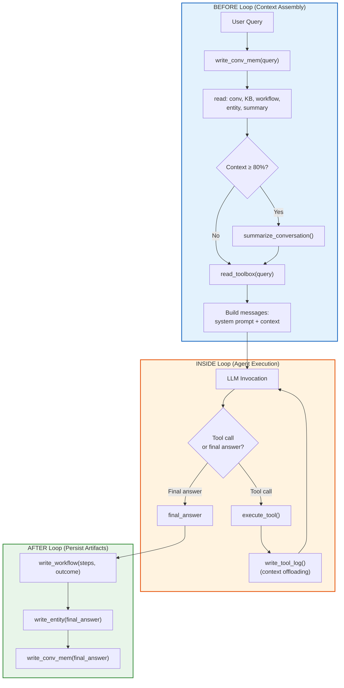

# Deterministic vs Agent-Triggered Operations

Memory operations in memharness fall into two categories: **deterministic** (always run, like an alarm clock) and **agent-triggered** (judgment calls, when the agent decides). Understanding this distinction is critical for building reliable memory-aware agents.

## The Core Distinction

```
                   Memory Operations
                  ╱                  ╲
      ┌──────────────────┐   ┌──────────────────┐
      │   DETERMINISTIC  │   │  AGENT-TRIGGERED  │
      │                  │   │                   │
      │  Runs ALWAYS —   │   │  Agent DECIDES    │
      │  fixed schedule  │   │  when to invoke   │
      │  or predefined   │   │  based on real-   │
      │  conditions      │   │  time judgment    │
      └──────────────────┘   └──────────────────┘
```

| Operation | Deterministic | Agent-Triggered |
|-----------|:---:|:---:|
| `read_conversational_memory()` | ✅ | ❌ |
| `read_knowledge_base()` | ✅ | ❌ |
| `read_workflow()` | ✅ | ❌ |
| `read_entity()` | ✅ | ❌ |
| `write_conversational_memory()` | ✅ | ❌ |
| `write_workflow()` | ✅ | ❌ |
| `read_summary_context()` | ❌ | ✅ |
| `write_entity()` | ❌ | ✅ |
| `search_tavily()` | ❌ | ✅ |
| `expand_summary()` | ❌ | ✅ |
| `summarize_and_store()` | ❌ | ✅ |
| `read_toolbox()` | ✅ | ✅ |

## Why Deterministic Operations?

### For Retrieval (reads)

1. **Context bootstrapping is non-negotiable** — The agent needs prior context to stay consistent. You can't skip loading memory and expect the agent to work.

2. **Chicken-and-egg problem** — The agent can't decide to look up what it doesn't know exists. You need memory to know which memory you need!

3. **Predictability** — Always loading memory = consistent, debuggable behavior. No surprises.

### For Storage (writes)

1. **Reliability** — You don't want the agent to "forget to save" important information.

2. **Completeness** — Every interaction recorded, no gaps in the audit trail.

3. **Reduced cognitive load** — The model focuses on the task, not bookkeeping operations.

## Why Agent-Triggered Operations?

1. **Not everything deserves storage** — The agent distinguishes signal from noise. Not every passing mention of a person needs to become an Entity memory.

2. **Cost & latency control** — Deep retrieval, summarization, and extraction cost tokens and time. Run them only when needed.

3. **Higher quality memory** — Decisions about *what to store* require semantic understanding. Agents make better judgment calls than heuristics.

## The BEFORE / INSIDE / AFTER Pattern

This is the architectural pattern for a memory-aware agent loop:



### BEFORE the Loop

**Deterministic operations that always run:**

| Operation | Why |
|-----------|-----|
| `read_conversational_memory()` | Load chat history from previous sessions |
| `read_knowledge_base()` | Load relevant KB passages |
| `read_workflow()` | Load reusable step patterns |
| `read_entity()` | Load known people, places, systems |
| `read_summary()` | Load compressed past conversations |
| `read_toolbox()` | Retrieve relevant tools for this query |
| `write_conversational_memory()` | Save user's query before entering loop |
| **Context check** (80%+) | If context too full → trigger `summarize_conversation` |

### INSIDE the Loop

**Agent-triggered operations (tools):**

| Operation | Triggered by | Example |
|-----------|-------------|---------|
| `search_tavily()` | Agent (tool call) | Agent decides it needs web info |
| `expand_summary()` | Agent (tool call) | Agent needs details from a compacted summary |
| `summarize_and_store()` | Agent OR programmatic | Agent decides to summarize, OR 80% threshold hit |
| `write_tool_log()` | Programmatic | Every tool execution is logged (context offloading) |
| `read_summary/entity/workflow` | Agent (tool call) | Agent can request more memory mid-loop |

### AFTER the Loop

**Deterministic cleanup:**

| Operation | Why |
|-----------|-----|
| `write_workflow()` | Save the steps + outcome as reusable workflow |
| `write_entity()` | Extract and save entities from final answer |
| `write_conversational_memory()` | Save assistant's final answer |

## Code Examples

### Deterministic Operations

These run automatically, no LLM decision needed:

```python
from memharness import MemoryHarness

async with MemoryHarness("sqlite:///memory.db") as memory:
    # BEFORE loop — always load context
    conv_history = await memory.get_conversational("thread1")
    kb_results = await memory.search_knowledge("Python async")
    workflows = await memory.search_workflow("web scraping")

    # ... agent loop ...

    # AFTER loop — always save
    await memory.add_conversational("thread1", "assistant", final_answer)
    await memory.add_workflow(steps, outcome="success")
```

### Agent-Triggered Operations

These are tools the agent can invoke during execution:

```python
# Tool available to agent
async def expand_summary(summary_id: str) -> str:
    """Expand a compacted summary back to full detail."""
    return await memory.expand_summary(summary_id)

# Tool available to agent
async def search_web(query: str) -> list[dict]:
    """Search the web and store results in knowledge base."""
    results = await tavily_client.search(query)
    for result in results:
        await memory.add_knowledge(result["content"], source=result["url"])
    return results

# Agent decides when to call these based on context
```

### Context Window Monitor

The 80% threshold is deterministic, but triggers agent-aware behavior:

```python
def monitor_context_window(context: str, model: str = "gpt-5") -> dict:
    estimated_tokens = len(context) // 4
    max_tokens = 256000
    percentage = (estimated_tokens / max_tokens) * 100

    if percentage < 50:
        status = "ok"
    elif percentage < 80:
        status = "warning"
    else:
        status = "critical"  # Trigger summarization

    return {"tokens": estimated_tokens, "percent": percentage, "status": status}
```

## Analogy

- **Deterministic** = Alarm clock. Goes off at 7 AM no matter what. Reliable, predictable.
- **Agent-triggered** = "I should probably check the weather before going out." Judgment call based on context.

Both are essential. Deterministic operations provide the reliable foundation. Agent-triggered operations provide the flexibility and intelligence.

## Next Steps

- [Memory Lifecycle](./memory-lifecycle) — How memory flows through the system
- [Embedded Agents](../agents/overview) — Deep dive into the agents that power AI operations
