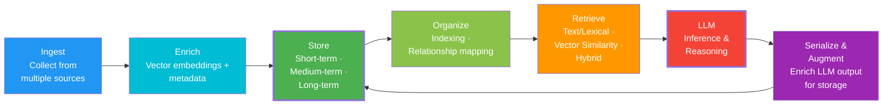
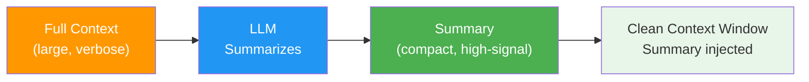
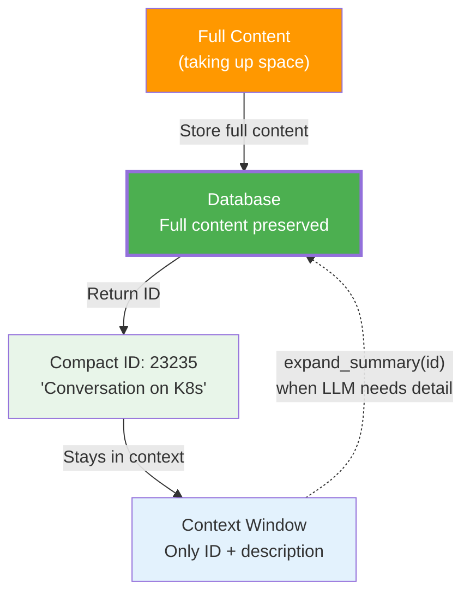
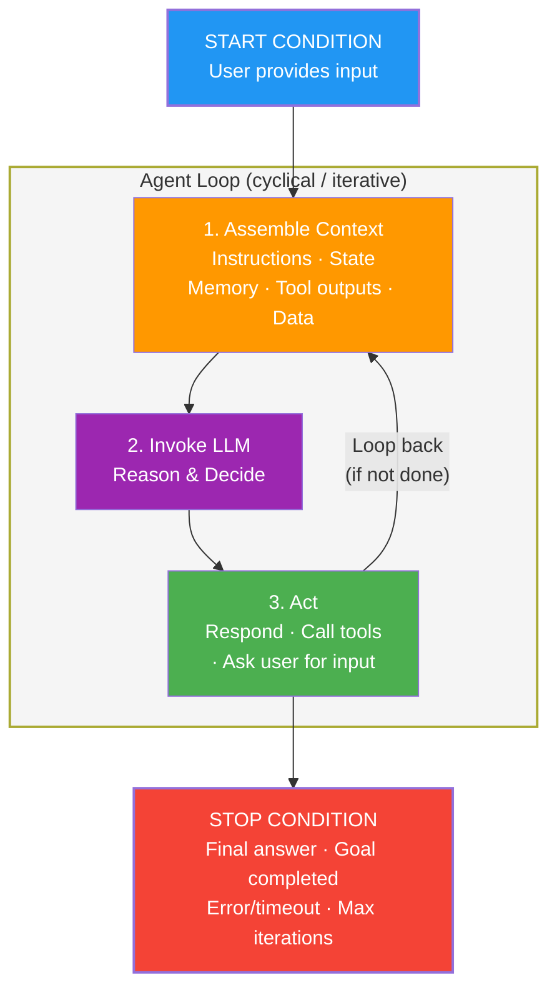

# Memory Lifecycle

The memory lifecycle is the continuous loop that makes an agent learn over time. It describes how information flows from ingestion → storage → retrieval → LLM processing → back to storage again.

## The Continuous Loop



**Key insight:** The LLM's output doesn't just go to the user — it also feeds **back into storage**. This creates a continuous learning cycle where the agent gets smarter over time.

## The 7 Stages

### 1. Ingest

Raw data enters the system from multiple sources:

- User messages
- Tool execution results
- Document uploads
- Agent responses
- Web search results

```python
# Example: ingesting from various sources
await memory.add_conversational("t1", "user", "Deploy the app to K8s")
await memory.add_knowledge("Kubernetes uses pods for deployment", source="docs")
```

### 2. Enrich

Data is enriched with metadata and structure:

- **Vector embeddings** — Created using an embedding model for semantic search
- **Metadata** — Timestamps, intent classification, source information
- **Semantic tags** — Categories, topics, sentiment
- **Relationships** — Links to related memories

```python
# Automatic enrichment on write
# - Embedding created via embedding model
# - Timestamp added automatically
# - Metadata extracted from context
# - Optionally: entity extraction via agent
```

### 3. Store

Enriched data is persisted based on memory type:

| Tier | What | When |
|------|------|------|
| **Hot** | Frequently accessed | Last 7 days |
| **Warm** | Occasionally accessed | 7-90 days |
| **Cold** | Archived | 90+ days |

Storage backend varies by memory type:
- **SQL tables** — Conversational, Tool Log (exact match, time-ordered)
- **Vector stores** — Everything else (semantic similarity search)

### 4. Organize

Data is indexed and relationships are mapped:

- **SQL indexes** — B-tree indexes on `thread_id`, `timestamp` for fast lookups
- **Vector indexes** — HNSW (Hierarchical Navigable Small World) indexes for semantic search
- **Relationship mapping** — Temporal relationships (sequence), semantic relationships (similarity), relational connections (entity → entity)

Vector indexes enable fast retrieval without scanning all rows — like a book index instead of reading every page.

### 5. Retrieve

Data is recalled based on query context using multiple strategies:

| Strategy | How it works | When to use |
|----------|-------------|------------|
| **Text/Lexical** | Exact keyword match (SQL `LIKE`, full-text search) | Thread-scoped messages, tool logs |
| **Vector Similarity** | Cosine similarity in embedding space | Semantic search across KB, entities, workflows |
| **Graph Traversal** | Follow entity relationships | "Find all people who worked on project X" |
| **Hybrid** | Combine keyword + semantic + graph | Complex multi-criteria queries |

```python
# Different retrieval patterns
conv = await memory.get_conversational("thread1")  # Exact match
kb = await memory.search_knowledge("async programming")  # Semantic
entities = await memory.search_entity("Dr. Chen")  # Hybrid
```

### 6. Assemble (Context Engineering)

Context is assembled for LLM consumption — this is **context engineering**:

> **Context Engineering** = The practice of optimally selecting and shaping information placed into an LLM context window so it can perform a task reliably — while explicitly accounting for context window limits.

```
┌─ Data Sources ──────┐     ┌─ Optimally Selected ─┐     ┌─ Context Window ───────────┐
│  Databases          │     │                      │     │  System Instructions       │
│  APIs               │ ──► │  Filter & curate     │ ──► │  Knowledge Base Docs       │
│  MCP Servers        │     │  what goes IN         │     │  Tools  Tools  Tools       │
│  Internet           │     └──────────────────────┘     │  Entity Mem | Workflow Mem │
└─────────────────────┘                                   │  Conversational Memory     │
                                                          │  User Prompt               │
                                                          └────────────────────────────┘
```

**Goal:** Maximize signal-to-noise ratio per token. Don't stuff everything — curate what matters.

```python
context = await memory.assemble_context(
    query="deploy app to kubernetes",
    thread_id="t1",
    max_tokens=4000
)
# Returns structured markdown with:
# - System instructions
# - Relevant knowledge base passages
# - Conversation history
# - Relevant entities
# - Applicable workflows
```

### 7. LLM Processing

The LLM processes the assembled context and generates a response.

### 8. Serialize & Augment

LLM output is serialized back into memory — creating the **continuous learning cycle**:

- Assistant responses → Conversational memory
- Extracted facts → Entity memory
- Learned patterns → Workflow memory
- Tool execution logs → Tool Log memory

**The cycle continues!** LLM output becomes new memory → gets organized → retrieved in future turns → processed by LLM again.

## Context Window Reduction

When the context window fills up, you have two weapons:

### Summarization (Lossy Compression)

Pass full context through an LLM → get a shorter representation → inject into clean context window.



**The 3 goals of good summarization:**

1. **Retain highest-signal info** — Keep task-relevant facts, claims, decisions
2. **Preserve meaning & relationships** — Who did what, why, results
3. **Remove redundancy & noise** — Low-value details, repetitive content

**The catch:** Summarization is **lossy** — like JPEG compression. Some information is permanently lost. Quality depends heavily on the summarization prompt.

### Compaction (Lossless Offload)

Move full content to the database and keep only an **ID + short description** in the context window. The LLM can retrieve full content on demand.



**Why compaction > summarization:**

| | Summarization | Compaction |
|--|---|---|
| **Data loss** | ⚠️ Lossy — always loses some info | ✅ Lossless — full content in DB |
| **Context savings** | Good | Great (only ID + description kept) |
| **Retrieve detail** | ❌ Can't get back what's lost | ✅ `expand_summary(id)` gets everything |
| **Cost** | LLM call needed | Just a DB write + read |

### Context Window Monitor

Track usage and trigger actions:

```python
def monitor_context_window(context: str, model: str = "gpt-5") -> dict:
    estimated_tokens = len(context) // 4
    max_tokens = 256000
    percentage = (estimated_tokens / max_tokens) * 100

    if percentage < 50:
        status = "ok"  # 🟢 All good
    elif percentage < 80:
        status = "warning"  # 🟡 Getting full
    else:
        status = "critical"  # 🔴 Summarize NOW

    return {"tokens": estimated_tokens, "percent": percentage, "status": status}
```

**Three states:** `ok` (below 50%) → `warning` (50-80%) → `critical` (above 80%, trigger summarization)

## Memory Operations

### Summarization Pipeline

| Step | What happens |
|------|-------------|
| ① | Read all **unsummarized** messages from a thread (SQL: `WHERE summary_id IS NULL`) |
| ② | Build a transcript from those messages |
| ③ | Send transcript to LLM → get structured summary |
| ④ | Store summary in summary memory with a `summary_id` |
| ⑤ | Mark original messages with that `summary_id` → won't be summarized again |

### Expand Summary (Lossless Retrieval)

```python
async def expand_summary(summary_id: str) -> str:
    """Retrieve full original content from a compacted summary."""
    summary_text = await memory.read_summary(summary_id)
    original_conversations = await memory.read_conversations_by_summary_id(summary_id)
    return f"{summary_text}\n{original_conversations}"
```

Compacted content → `expand_summary(id)` → get FULL original 32 messages back. **Lossless!**

### Consolidation

Merge similar memories to reduce duplication:

```
┌─────────────────────────────────────┐
│  Duplicate entities                  │
│  • "Dr. Chen" (created day 1)       │
│  • "Dr. Sarah Chen" (created day 5) │
│  • "Sarah Chen" (created day 10)    │
└───────────────┬─────────────────────┘
                │ consolidate()
                ▼
┌─────────────────────────────────────┐
│  Single merged entity                │
│  • "Dr. Sarah Chen"                 │
│    - aliases: ["Dr. Chen", "Sarah"] │
│    - merged from 3 sources          │
└─────────────────────────────────────┘
```

Uses semantic similarity + heuristics to detect duplicates, then merges them intelligently.

### Garbage Collection

Clean expired and orphaned memories:

- **Archive** old memories to cold storage
- **Delete** from cold storage after retention period
- **Protect referenced** memories (e.g., originals linked to summaries)

## The Agent Loop

Putting it all together — the agent loop that uses the memory lifecycle:



**The 3 steps (every iteration):**

1. **Assemble Context** — Gather everything the LLM needs (memory retrieval happens here)
2. **Invoke LLM** — LLM reasons and decides
3. **Act** — Execute the decision (memory writes happen here)

Loops until stop condition: final answer, goal completed, error/timeout, or max iterations.

## Next Steps

- [Embedded Agents](../agents/overview) — The agents that power AI operations
- [Deterministic vs AI Operations](./deterministic-vs-ai) — When operations run automatically vs on-demand
