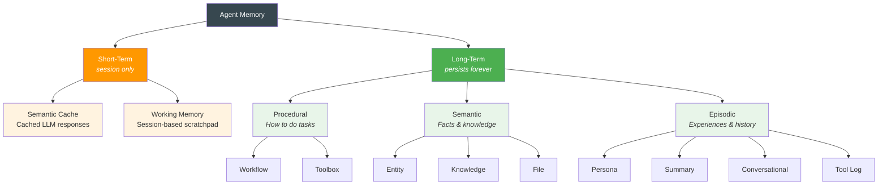

# Memory Types

memharness provides **9 distinct memory types**, each optimized for specific retrieval patterns and use cases. Understanding the memory taxonomy helps you choose the right type for your agent's needs.

## Memory Taxonomy

Agent memory follows a hierarchical taxonomy based on duration and purpose:



### Short-Term Memory

**Short-term memory** exists only during a session and is lost afterward:

| Type | What it stores | Example |
|------|---------------|---------|
| **Semantic Cache** | Vector search + cached LLM responses for similar queries | "Weather in Delhi?" → reuse cached response |
| **Working Memory** | LLM context window + session-based memory (scratchpad) | Chain-of-thought reasoning, intermediate results |

Short-term memory is like RAM — gone when you shut down.

### Long-Term Memory

**Long-term memory** persists across sessions and survives restarts. memharness implements three categories:

#### Procedural Memory (How to do tasks)

| Type | What it stores | Example |
|------|---------------|---------|
| **Workflow** | Step-by-step procedures that worked | "Called API A → parsed → triggered B" |
| **Toolbox** | Tool configurations and capabilities | `search_arxiv(query: str, k: int) → "Search papers"` |

#### Semantic Memory (Facts & knowledge)

| Type | What it stores | Example |
|------|---------------|---------|
| **Entity** | People, organizations, systems | "Ayush works at SAP", "Kafka uses partitions" |
| **Knowledge** | Domain knowledge, documents | arXiv papers, product docs, reference material |
| **File** | Document references | `/docs/architecture.pdf` |

#### Episodic Memory (Experiences & history)

| Type | What it stores | Example |
|------|---------------|---------|
| **Persona** | Agent identity and behavioral patterns | "I am a helpful coding assistant" |
| **Summary** | Compressed past conversations | 30 messages → 1 paragraph |
| **Conversational** | Complete chat history | `[user] "Book the first one for 7pm"` |
| **Tool Log** | Tool execution audit trail | `search_arxiv({query:"flash"}) → 5 results (success)` |

## The 9 Memory Types

memharness implements the long-term memory types:

| Memory Type | One-Liner | Storage | What Gets Stored |
|-------------|-----------|---------|------------------|
| **Conversational** | Chat history per thread | SQL | `role`, `content`, `timestamp` per message |
| **Knowledge** | Domain knowledge & facts | Vector | Documents, papers, reference material + embeddings |
| **Workflow** | "How did I do this before?" | Vector | Steps taken + outcome for a task |
| **Toolbox** | Available tools & capabilities | Vector | Tool name, description, parameters, signature |
| **Entity** | People, places, systems | Vector | Name, type (PERSON/PLACE/SYSTEM), description |
| **Summary** | Compressed older conversations | Vector | Condensed context when chat history gets too long |
| **Tool Log** | Raw tool execution audit trail | SQL | Tool name, args, result, status, timestamp |
| **File** | Document references | Vector | File path, content snippets, metadata |
| **Persona** | Agent identity | Vector | Behavioral patterns, style, preferences |

## Storage Strategy: SQL vs Vector

Different memory types use different storage strategies based on their access patterns:

| Storage | Used For | Why | Access Pattern |
|---------|----------|-----|----------------|
| **SQL** | Conversational, Tool Log | Exact match by `thread_id`, chronological ordering — no semantic search needed | Time-ordered retrieval by thread |
| **Vector** | Everything else | **Semantic similarity search** — find relevant content by meaning, not exact keywords | Top-K similarity search |

### Why Two Storage Types?

The decision is driven by how you need to retrieve the memory:

- **SQL** = "Give me exact match on thread_id, ordered by timestamp"
- **Vector** = "Find me stuff *similar to* this query based on semantic meaning"

Different tools for different jobs.

### SQL Tables: Conversational & Tool Log

These memories need exact-match retrieval and chronological ordering:

```sql
CREATE TABLE conversational_memory (
    id VARCHAR PRIMARY KEY,
    thread_id VARCHAR NOT NULL,
    role VARCHAR NOT NULL,  -- 'user' or 'assistant'
    content TEXT NOT NULL,
    timestamp TIMESTAMP NOT NULL,
    summary_id VARCHAR,  -- Links to summary when compacted
    metadata JSONB
);

CREATE INDEX idx_thread_time ON conversational_memory(thread_id, timestamp);
```

### Vector Stores: Everything Else

These memories need semantic similarity search:

- Each memory unit is embedded using an embedding model
- Embedding + metadata → stored in vector store
- Query is embedded → top-K similarity search finds closest matches
- Results ranked by cosine similarity (or other distance metrics)

Vector indexes (HNSW, IVF) enable fast retrieval without scanning all rows.

## Quick Reference

| Memory Type | Example | When to Use |
|-------------|---------|------------|
| **Conversational** | `[user] "Book the first one for 7pm"` | Chat history, multi-turn context |
| **Knowledge** | arXiv papers, product docs | Facts the agent should ground responses in |
| **Entity** | `Dr. Sarah Chen (PERSON): MIT, efficient attention` | Track people, places, organizations |
| **Workflow** | `Query → arXiv search → filter → summarize → ✅` | Reusable procedures that worked |
| **Toolbox** | `search_arxiv(query, k=5) → "Search arXiv papers"` | Tool discovery and selection |
| **Summary** | 30 messages → 1 paragraph summary | Compress old conversations |
| **Tool Log** | `search_arxiv({query:"flash"}) → 5 results (success)` | Audit trail, debugging |
| **File** | `/path/to/report.pdf` | Document tracking |
| **Persona** | `"I am a helpful coding assistant"` | Agent identity |

## Workflow vs Tool Log

A common point of confusion:

| | Workflow Memory | Tool Log |
|--|---|---|
| **Purpose** | Reusable patterns | Raw audit trail |
| **Content** | "What strategy worked" | "What exactly happened" |
| **Analogy** | Recipe | Kitchen CCTV |
| **Search** | Semantic (find similar workflows) | Exact match (by thread_id/time) |

## Next Steps

- [Deterministic vs AI Operations](./deterministic-vs-ai) — When operations run automatically vs on-demand
- [Memory Lifecycle](./memory-lifecycle) — How memory flows through the system
- [Individual Memory Types](../memory-types/conversational) — Deep dive into each type
