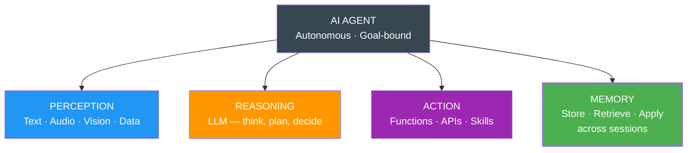

# Introduction

**memharness** is a framework-agnostic Python package that provides memory infrastructure for AI agents. It enables any agent framework — LangChain, LangGraph, CrewAI, Deep Agents, or custom — to have persistent, searchable, typed memory with built-in lifecycle management.

## The Goldfish Problem

Stateless agents have amnesia. Every session starts from scratch. It's like having a brilliant friend who forgets everything the moment you hang up:

| | Stateless Agent | Memory-Aware Agent |
|--|---|---|
| **Session 1** | Does great work | Does great work |
| **Session ends** | Everything gone | Memory persists |
| **Session 2** | Blank slate, starts over | Picks up where it left off |

This isn't just inconvenient — it makes long-horizon tasks, cross-session continuity, and true learning impossible. Stateless agents can't do work that spans minutes, hours, or days.

## The 4 Pillars of an AI Agent

An agent needs all four to be truly autonomous:



**Perception, Reasoning, Action** = body. **Memory** = soul. Without memory, an agent forgets everything from 5 minutes ago.

## What memharness Provides

memharness is **memory infrastructure**, not a feature. It's external to the model, persistent, structured, and queryable.

- **Typed memories** — 9 distinct memory types, each optimized for its use case
- **Any backend** — PostgreSQL (with pgvector), SQLite, or in-memory
- **Lifecycle management** — Automated summarization, consolidation, and garbage collection
- **Agent self-awareness** — Agents can explore and manage their own memory via tools
- **Framework agnostic** — Works with any Python agent framework

## Install

```bash
pip install memharness
```

## Quick Example

```python
from memharness import MemoryHarness

async with MemoryHarness("sqlite:///memory.db") as memory:
    # Store conversational memory
    await memory.add_conversational("thread1", "user", "What is Python?")
    await memory.add_conversational("thread1", "assistant", "Python is a programming language.")

    # Store knowledge
    await memory.add_knowledge(
        "Python supports async/await since version 3.5",
        source="python-docs",
    )

    # Semantic search
    results = await memory.search_knowledge("async programming")

    # Assemble context for LLM
    context = await memory.assemble_context("Tell me about async", "thread1")
```

## The 9 Memory Types

| Type | Purpose | Storage |
|------|---------|---------|
| **Conversational** | Chat history per thread | SQL (ordered) |
| **Knowledge** | Facts, docs, reference material | Vector (semantic) |
| **Entity** | People, orgs, systems, concepts | Vector |
| **Workflow** | Step-by-step procedures | Vector |
| **Toolbox** | Tool definitions with semantic discovery | Vector |
| **Summary** | Compressed memories (expandable) | Vector |
| **Tool Log** | Tool execution audit trail | SQL (ordered) |
| **File** | Document references | Vector |
| **Persona** | Agent identity and style | Vector |

Two storage strategies:
- **SQL** for exact-match queries (conversations, tool logs)
- **Vector** for semantic similarity search (everything else)

## Memory Engineering

memharness is built on the principles of **Memory Engineering** — an emerging discipline at the intersection of:

1. **Database Engineering** — Persistent storage, indexing, multi-store architecture
2. **Agent Engineering** — Memory lifecycle, write-back loops, extraction, consolidation
3. **ML Engineering** — Embeddings, model versioning, reranking, continual learning
4. **Information Retrieval** — Hybrid search, vector indexes, relevance ranking

Memory is **infrastructure**, not a feature. External to the model, persistent, structured, queryable. It's what makes stateful, learning-capable AI systems possible.

## Next Steps

- [Getting Started](./getting-started) — Full setup guide with architecture diagrams
- [Core Concepts](./concepts/memory-types) — Memory types, lifecycle, and operations
- [API Reference](./api/harness) — Complete API docs
- [Backends](./backends/sqlite) — Backend configuration
