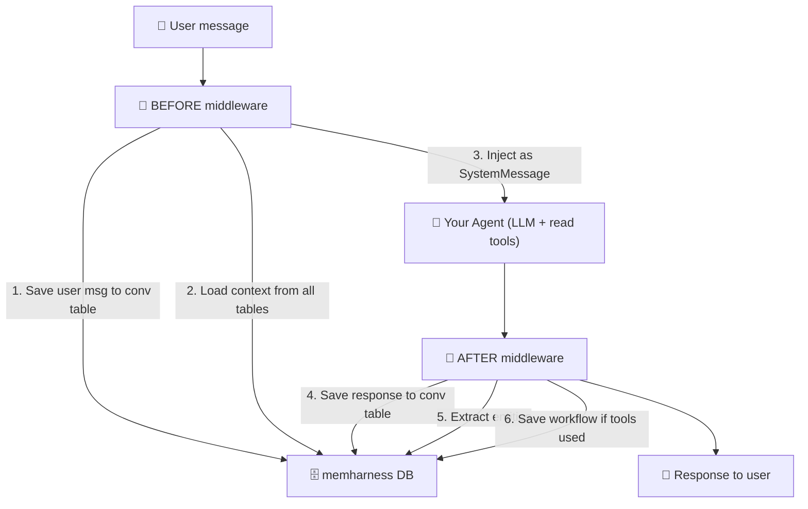

# Usage with LangChain

This guide shows how to use memharness with LangChain agents. memharness provides the memory infrastructure — you wire it into your agent via middleware.

## Install

```bash
pip install memharness langchain langgraph langchain-anthropic
# or any LLM provider: langchain-openai, langchain-google-genai, etc.
```

## Architecture



**Your agent only gets READ tools** — it searches and reads memory.
**Middleware handles all WRITES** — saves messages, extracts entities, stores workflows.

## Quick Start

```python
import asyncio
from memharness import MemoryHarness
from memharness.tools import get_memory_tools
from langchain.agents import create_agent


async def main():
    # Initialize memory
    harness = MemoryHarness("sqlite:///agent_memory.db")
    await harness.connect()

    # Create your agent with memory read tools
    agent = create_agent(
        model="anthropic:claude-sonnet-4-6",
        tools=get_memory_tools(harness),  # 7 tools for memory self-awareness
        system_prompt="You are a helpful assistant with persistent memory.",
    )

    result = await agent.ainvoke({
        "messages": [{"role": "user", "content": "My name is Alice, I work at SAP"}]
    })
    print(result["messages"][-1].content)

    await harness.disconnect()


asyncio.run(main())
```

## Conversation Persistence Middleware

This middleware saves every conversation turn to memharness, and loads past messages on each new turn:

```python
from langchain.agents.middleware import AgentMiddleware
from langchain_core.messages import HumanMessage, AIMessage, SystemMessage
from memharness import MemoryHarness


class MemharnessConversationMiddleware(AgentMiddleware):
    """Persist conversation history to/from memharness.

    BEFORE model call: load past messages from conv table → inject into state
    AFTER model call: save new messages to conv table
    """

    def __init__(self, harness: MemoryHarness, thread_id: str):
        super().__init__()
        self.harness = harness
        self.thread_id = thread_id
        self._loaded_count = 0

    async def abefore_model(self, state, runtime):
        """Load past conversation from memharness into agent state."""
        memories = await self.harness.get_conversational(self.thread_id, limit=50)
        if not memories:
            return None

        # Convert MemoryUnits to LangChain messages
        past_messages = []
        for m in memories:
            role = m.metadata.get("role", "user")
            if role in ("user", "human"):
                past_messages.append(HumanMessage(content=m.content))
            elif role in ("assistant", "ai"):
                past_messages.append(AIMessage(content=m.content))

        current = list(state.get("messages", []))
        self._loaded_count = len(current)
        return {"messages": past_messages + current}

    async def aafter_model(self, state, runtime):
        """Save new messages to memharness after model response."""
        messages = state.get("messages", [])
        new_messages = messages[self._loaded_count:]

        for msg in new_messages:
            if isinstance(msg, HumanMessage):
                await self.harness.add_conversational(
                    self.thread_id, "user", msg.content
                )
            elif isinstance(msg, AIMessage) and msg.content:
                await self.harness.add_conversational(
                    self.thread_id, "assistant", msg.content
                )

        self._loaded_count = len(messages)
        return None
```

## Context Assembly Middleware

This middleware injects full memory context (knowledge base, entities, workflows, persona) as a SystemMessage before each model call:

```python
from memharness.agents import ContextAssemblyAgent


class MemharnessContextMiddleware(AgentMiddleware):
    """Inject full memory context before each model call.

    Uses ContextAssemblyAgent to load:
    - Persona (agent identity)
    - Knowledge base (relevant facts)
    - Entities (people, places, systems)
    - Workflows (reusable patterns)
    - Summaries (compressed older conversations)
    """

    def __init__(
        self,
        harness: MemoryHarness,
        thread_id: str,
        max_tokens: int = 4000,
    ):
        super().__init__()
        self.harness = harness
        self.thread_id = thread_id
        self._ctx_agent = ContextAssemblyAgent(harness, max_tokens=max_tokens)

    async def abefore_model(self, state, runtime):
        """Assemble memory context and inject as SystemMessage."""
        messages = state.get("messages", [])
        if not messages:
            return None

        # Find the latest user message as query
        query = ""
        for msg in reversed(messages):
            if isinstance(msg, HumanMessage):
                query = msg.content
                break

        if not query:
            return None

        # Assemble context from all memory types
        ctx = await self._ctx_agent.assemble(
            query=query,
            thread_id=self.thread_id,
            include_tools=False,
        )

        # Build context sections
        sections = []
        if ctx.persona:
            sections.append(f"## Agent Persona\n{ctx.persona}")
        if ctx.knowledge:
            sections.append(f"## Relevant Knowledge\n{ctx.knowledge}")
        if ctx.entities:
            sections.append(f"## Known Entities\n{ctx.entities}")
        if ctx.workflows:
            sections.append(f"## Relevant Workflows\n{ctx.workflows}")

        if not sections:
            return None

        context_msg = SystemMessage(content="\n\n".join(sections))
        return {"messages": [context_msg] + list(messages)}
```

## Entity Extraction Middleware

This middleware automatically extracts entities from the agent's response and stores them:

```python
from memharness.agents import EntityExtractorAgent


class MemharnessEntityMiddleware(AgentMiddleware):
    """Extract and store entities after each model response."""

    def __init__(self, harness: MemoryHarness):
        super().__init__()
        self.harness = harness
        self._extractor = EntityExtractorAgent(harness)

    async def aafter_model(self, state, runtime):
        """Extract entities from the latest AI response."""
        messages = state.get("messages", [])
        if not messages:
            return None

        last_msg = messages[-1]
        if not isinstance(last_msg, AIMessage) or not last_msg.content:
            return None

        # Extract entities using regex (fast, no LLM needed)
        entities = await self._extractor.extract_entities(last_msg.content)
        for category, names in entities.items():
            for name in names:
                await self.harness.add_entity(
                    name=name,
                    entity_type=category,
                    description=f"{category}: {name}",
                )

        return None
```

## Putting It All Together

```python
import asyncio
from memharness import MemoryHarness
from memharness.tools import get_memory_tools
from langchain.agents import create_agent
# Import middleware classes from above


async def main():
    # 1. Initialize memory
    harness = MemoryHarness("sqlite:///agent_memory.db")
    await harness.connect()

    # 2. Pre-load some knowledge
    await harness.add_knowledge(
        "Deployments require approval from the platform team",
        source="runbook",
    )
    await harness.add_knowledge(
        "Use kubectl apply -f deployment.yaml for Kubernetes deploys",
        source="wiki",
    )

    # 3. Create agent with read tools + all middleware
    thread_id = "user-alice-001"

    agent = create_agent(
        model="anthropic:claude-sonnet-4-6",
        tools=get_memory_tools(harness),
        middleware=[
            # Inject full memory context (KB, entities, workflows, persona)
            MemharnessContextMiddleware(harness, thread_id=thread_id),
            # Persist conversation across sessions
            MemharnessConversationMiddleware(harness, thread_id=thread_id),
            # Extract entities from responses
            MemharnessEntityMiddleware(harness),
        ],
        system_prompt=(
            "You are a helpful DevOps assistant with persistent memory.\n"
            "Search your memory before answering questions.\n"
            "Your memory context is provided in the system message."
        ),
    )

    # 4. First conversation
    print("--- Turn 1 ---")
    r1 = await agent.ainvoke({
        "messages": [{"role": "user", "content": "How do I deploy to production?"}]
    })
    print(r1["messages"][-1].content)

    # 5. Second conversation (memory persists!)
    print("\n--- Turn 2 ---")
    r2 = await agent.ainvoke({
        "messages": [{"role": "user", "content": "What did I just ask about?"}]
    })
    print(r2["messages"][-1].content)

    # 6. Check what's in memory
    entities = await harness.search_entity("deploy", k=5)
    print(f"\nEntities extracted: {len(entities)}")
    for e in entities:
        print(f"  - {e.metadata.get('entity_name', '?')}: {e.content}")

    await harness.disconnect()


asyncio.run(main())
```

## LangGraph Workflow (Alternative)

For more control, use the built-in LangGraph workflow that handles the full BEFORE → INSIDE → AFTER cycle:

```python
from memharness.agents.agent_workflow import create_memory_agent

graph = create_memory_agent(
    harness=harness,
    llm="anthropic:claude-sonnet-4-6",
    tools=[my_web_search],  # your custom tools
)

result = await graph.ainvoke({
    "messages": [],
    "thread_id": "user-1",
    "query": "How do I deploy?",
})
print(result["final_answer"])
```

The graph handles: save user msg → assemble context → check size → summarize if needed → call LLM → save response → extract entities → save workflow.

## What Each Middleware Does

| Middleware | When | What |
|-----------|------|------|
| **MemharnessContextMiddleware** | BEFORE model | Loads KB, entities, workflows, persona → injects as SystemMessage |
| **MemharnessConversationMiddleware** | BEFORE + AFTER | Loads past messages → injects. Saves new messages after response |
| **MemharnessEntityMiddleware** | AFTER model | Extracts entities from response → stores in entity table |

## The 7 Memory Tools

These tools let the agent explore and manage its own memory INSIDE the loop:

| Tool | Type | What it does |
|------|------|-------------|
| `memory_search` | Read | Search across all memory types |
| `memory_read` | Read | Read a specific memory by ID |
| `memory_write` | Write | Write to any memory type |
| `expand_summary` | Read | Expand compacted summary to full content |
| `summarize_conversation` | Write | Compress a conversation thread |
| `assemble_context` | Read | Full context assembly |
| `toolbox_search` | Read | Discover available tools |

## Summarization

After summarization, the conversation middleware loads **summary + recent messages only**:

```
Before: [msg1, msg2, ... msg50]           ← all 50 messages
After:  [Summary of msg1-40] + [msg41-50] ← compact!
```

The agent can call `expand_summary` tool if it needs the full detail back.
