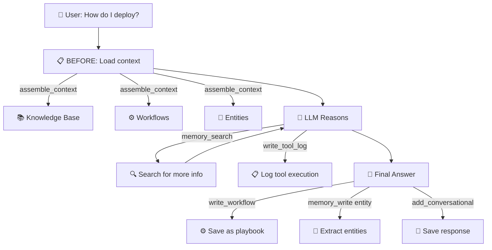

# Usage with LangChain

This guide shows how to use memharness with LangChain's `create_agent`. memharness provides the memory infrastructure and tools — you wire them into your agent.

## Install

```bash
pip install memharness langchain langchain-anthropic
# or any LLM provider: langchain-openai, langchain-google-genai, etc.
```

## Basic: Agent with Memory Tools

```python
import asyncio
from memharness import MemoryHarness
from memharness.tools import get_memory_tools
from langchain.agents import create_agent


async def main():
    # 1. Initialize memory
    harness = MemoryHarness("sqlite:///agent_memory.db")
    await harness.connect()

    # 2. Pre-load some knowledge (one-time setup)
    await harness.add_knowledge(
        "The company uses Kubernetes for container orchestration",
        source="internal-wiki",
    )
    await harness.add_knowledge(
        "Production deployments require approval from the platform team",
        source="runbook",
    )

    # 3. Get all 12 memory tools
    memory_tools = get_memory_tools(harness)

    # 4. Create agent with memory tools
    agent = create_agent(
        model="anthropic:claude-sonnet-4-6",
        tools=memory_tools,
        system_prompt=(
            "You are a helpful DevOps assistant with persistent memory.\n"
            "Use your memory tools to:\n"
            "- Search knowledge base before answering questions\n"
            "- Save important facts the user tells you\n"
            "- Log your tool executions for audit trail\n"
            "- Save successful procedures as reusable workflows\n"
        ),
    )

    # 5. Run the agent
    result = await agent.ainvoke(
        {"messages": [{"role": "user", "content": "How do we deploy to production?"}]}
    )
    print(result["messages"][-1].content)

    await harness.disconnect()


asyncio.run(main())
```

The agent will use `memory_search` to find the Kubernetes and approval knowledge, then answer grounded in that context.

## Conversation Persistence

To persist conversations across sessions, save messages after each turn:

```python
async def chat(agent, harness, thread_id: str, user_message: str) -> str:
    # Save user message to memory
    await harness.add_conversational(thread_id, "user", user_message)

    # Load past conversation for context
    history = await harness.get_conversational(thread_id, limit=20)

    # Build messages list with history
    from langchain_core.messages import HumanMessage, AIMessage

    messages = []
    for m in history:
        role = m.metadata.get("role", "user")
        if role == "user":
            messages.append(HumanMessage(content=m.content))
        elif role == "assistant":
            messages.append(AIMessage(content=m.content))

    # Run agent with full history
    result = await agent.ainvoke({"messages": messages})

    # Save assistant response
    response = result["messages"][-1].content
    await harness.add_conversational(thread_id, "assistant", response)

    return response
```

## Context Assembly Before Each Turn

For richer context (not just conversation, but KB + entities + workflows), use `ContextAssemblyAgent`:

```python
from memharness.agents import ContextAssemblyAgent


async def chat_with_full_context(agent, harness, thread_id: str, query: str) -> str:
    # Assemble all relevant context (BEFORE-loop pattern)
    ctx_agent = ContextAssemblyAgent(harness, max_tokens=4000)
    ctx = await ctx_agent.assemble(query=query, thread_id=thread_id)

    # Get as LangChain messages
    messages = ctx.to_messages()
    # messages = [
    #   SystemMessage(content="## Agent Persona\n...\n## Relevant Knowledge\n..."),
    #   HumanMessage(content="previous message"),
    #   AIMessage(content="previous response"),
    #   ...
    # ]

    # Run agent with assembled context
    result = await agent.ainvoke({"messages": messages})

    # Save response
    response = result["messages"][-1].content
    await harness.add_conversational(thread_id, "assistant", response)

    return response
```

## Middleware Pattern (Advanced)

For automatic conversation persistence, you can write a middleware:

```python
from langchain.agents.middleware import AgentMiddleware
from langchain_core.messages import HumanMessage, AIMessage


class MemharnessMemoryMiddleware(AgentMiddleware):
    """Middleware that persists conversation to memharness."""

    def __init__(self, harness, thread_id: str):
        super().__init__()
        self.harness = harness
        self.thread_id = thread_id
        self._last_msg_count = 0

    async def abefore_model(self, state, runtime):
        """Load past conversation from memharness into agent state."""
        memories = await self.harness.get_conversational(self.thread_id, limit=20)
        if not memories:
            return None

        past_messages = []
        for m in memories:
            role = m.metadata.get("role", "user")
            if role in ("user", "human"):
                past_messages.append(HumanMessage(content=m.content))
            elif role in ("assistant", "ai"):
                past_messages.append(AIMessage(content=m.content))

        current = list(state.get("messages", []))
        self._last_msg_count = len(current)
        return {"messages": past_messages + current}

    async def aafter_model(self, state, runtime):
        """Save new messages to memharness after model response."""
        messages = state.get("messages", [])
        new_msgs = messages[self._last_msg_count:]
        for msg in new_msgs:
            if isinstance(msg, HumanMessage):
                await self.harness.add_conversational(
                    self.thread_id, "user", msg.content
                )
            elif isinstance(msg, AIMessage) and msg.content:
                await self.harness.add_conversational(
                    self.thread_id, "assistant", msg.content
                )
        self._last_msg_count = len(messages)
        return None


# Usage
agent = create_agent(
    model="anthropic:claude-sonnet-4-6",
    tools=get_memory_tools(harness),
    middleware=[MemharnessMemoryMiddleware(harness, thread_id="user-123")],
)
```

## The 12 Tools Your Agent Gets

When you call `get_memory_tools(harness)`, the agent receives:

| Tool | What the agent can do |
|------|-----------------------|
| `memory_search` | Search knowledge, entities, workflows by query |
| `memory_read` | Read a specific memory by ID |
| `memory_write` | Write facts, entities to memory |
| `memory_stats` | Check memory health and counts |
| `expand_summary` | Expand a compacted summary to full content |
| `summarize_and_store` | Compress a long conversation thread |
| `write_tool_log` | Log tool executions for audit trail |
| `write_workflow` | Save a task as a reusable playbook |
| `get_conversation_history` | Get messages from a thread |
| `assemble_context` | Full context assembly across all types |
| `toolbox_tree` | Browse available tools (VFS) |
| `toolbox_grep` | Search tools by pattern |

## What the Agent Does With Memory



This is the BEFORE → INSIDE → AFTER loop pattern from the agent memory course.
