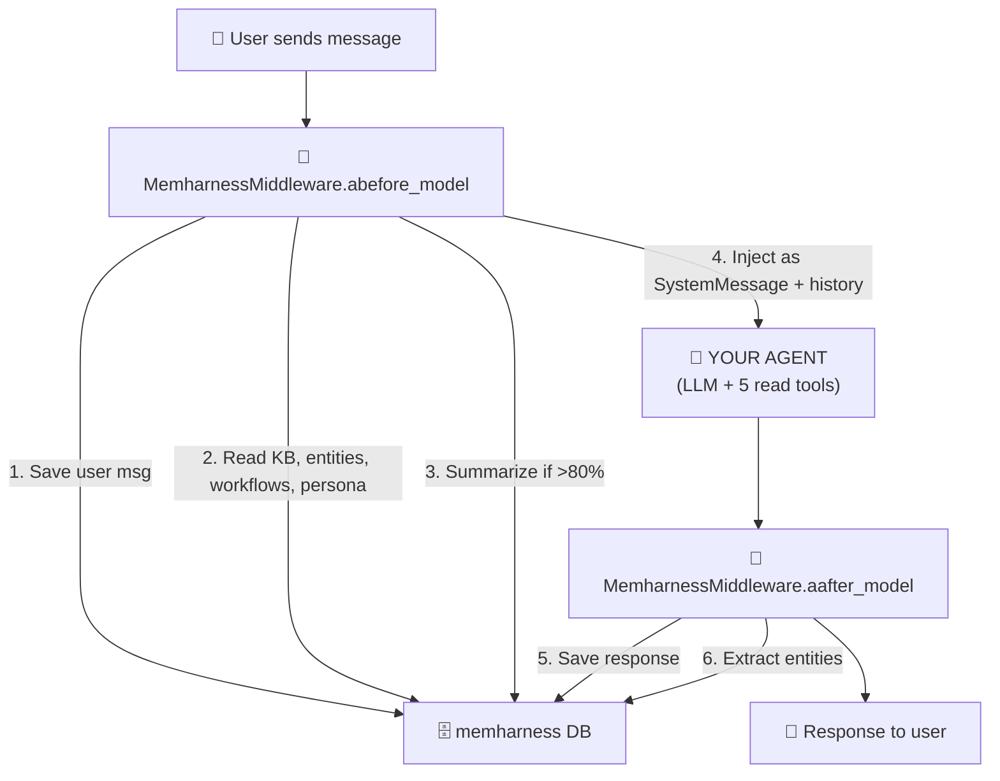

# Usage with LangChain

memharness wraps your LangChain agent with a single middleware that handles all memory operations — BEFORE and AFTER every model call.

## Install

```bash
pip install memharness langchain langchain-anthropic
```

## Quick Start — One Middleware Does Everything

```python
import asyncio
from memharness import MemoryHarness
from memharness.tools import get_read_tools
from memharness.agents import ContextAssemblyAgent, SummarizerAgent, EntityExtractorAgent
from langchain.agents import create_agent
from langchain.agents.middleware import AgentMiddleware
from langchain_core.messages import AIMessage, HumanMessage, SystemMessage


class MemharnessMiddleware(AgentMiddleware):
    """Single middleware that handles all memory operations.

    BEFORE model call:
    1. Save user message to conversation table
    2. Assemble context (KB, entities, workflows, persona, summaries)
    3. Auto-summarize if context > 80% full
    4. Inject context as SystemMessage + conversation history

    AFTER model call:
    5. Save assistant response to conversation table
    6. Extract entities from response (regex, no LLM needed)
    """

    def __init__(
        self,
        harness: MemoryHarness,
        thread_id: str,
        max_tokens: int = 4000,
        summarize_threshold: float = 0.8,
    ):
        super().__init__()
        self.harness = harness
        self.thread_id = thread_id
        self._ctx_agent = ContextAssemblyAgent(harness, max_tokens=max_tokens)
        self._summarizer = SummarizerAgent(harness)
        self._entity_extractor = EntityExtractorAgent(harness)
        self._summarize_threshold = summarize_threshold

    async def abefore_model(self, state, runtime):
        """BEFORE: save msg → assemble context → summarize if needed."""
        messages = state.get("messages", [])
        if not messages:
            return None

        # Find latest user query
        query = ""
        for msg in reversed(messages):
            if isinstance(msg, HumanMessage):
                query = msg.content
                break
        if not query:
            return None

        # 1. Save user message
        await self.harness.add_conversational(self.thread_id, "user", query)

        # 2. Assemble context from all memory types
        ctx = await self._ctx_agent.assemble(query=query, thread_id=self.thread_id)

        # 3. Auto-summarize if context too large
        if ctx.context_usage_percent >= self._summarize_threshold:
            await self._summarizer.summarize_thread(self.thread_id)
            ctx = await self._ctx_agent.assemble(query=query, thread_id=self.thread_id)

        # 4. Inject as messages (SystemMessage + conversation history)
        context_messages = ctx.to_messages()
        return {"messages": context_messages}

    async def aafter_model(self, state, runtime):
        """AFTER: save response → extract entities."""
        messages = state.get("messages", [])
        if not messages:
            return None

        last_msg = messages[-1]
        if not isinstance(last_msg, AIMessage) or not last_msg.content:
            return None

        # 5. Save assistant response
        await self.harness.add_conversational(
            self.thread_id, "assistant", last_msg.content
        )

        # 6. Extract entities from response
        try:
            entities = await self._entity_extractor.extract_entities(last_msg.content)
            for category, names in entities.items():
                for name in names:
                    await self.harness.add_entity(
                        name=name,
                        entity_type=category,
                        description=f"{category}: {name}",
                    )
        except Exception:
            pass  # Entity extraction is best-effort

        return None


async def main():
    # 1. Initialize memory
    harness = MemoryHarness("sqlite:///agent_memory.db")
    await harness.connect()

    # 2. Pre-load some knowledge (one-time setup)
    await harness.add_knowledge(
        "Deployments require approval from the platform team", source="runbook"
    )

    # 3. Create YOUR agent with read-only memory tools + single middleware
    agent = create_agent(
        model="anthropic:claude-sonnet-4-6",
        tools=get_read_tools(harness),  # 5 read-only tools
        middleware=[MemharnessMiddleware(harness, thread_id="user-alice")],
    )

    # 4. Just call it — middleware handles everything
    result = await agent.ainvoke({
        "messages": [{"role": "user", "content": "How do I deploy to production?"}]
    })
    print(result["messages"][-1].content)

    # Next turn — memory persists!
    result = await agent.ainvoke({
        "messages": [{"role": "user", "content": "What did I just ask about?"}]
    })
    print(result["messages"][-1].content)

    await harness.disconnect()


asyncio.run(main())
```

## How It Works



**Your agent only gets read tools** — it can search and read memory.
**The middleware handles all writes** — saves messages, extracts entities, manages summaries.

## What the Agent Sees

On every turn, the middleware injects context so the LLM sees:

```
[SystemMessage]
  ## Agent Persona
  You are a helpful DevOps assistant...

  ## Relevant Knowledge
  - Deployments require approval from the platform team
  - Use kubectl apply -f deployment.yaml

  ## Known Entities
  - Alice (PERSON): Engineer at SAP

  ## Relevant Workflows
  - Deploy app: Build → Test → Push → Apply

[HumanMessage] "previous question"
[AIMessage] "previous answer"
[HumanMessage] "How do I deploy?"   ← current query
```

The agent doesn't need to call any tools to get this context — the middleware provides it automatically.

## The 5 Read Tools

Your agent also gets 5 tools for deeper memory exploration:

```python
from memharness.tools import get_read_tools

tools = get_read_tools(harness)
```

| Tool | What the agent can do |
|------|-----------------------|
| `memory_search` | Search across all memory types by query |
| `memory_read` | Read a specific memory by ID |
| `expand_summary` | Expand a compacted summary to full content |
| `assemble_context` | Manually trigger full context assembly |
| `toolbox_search` | Discover available tools (VFS tree + grep) |

These are for when the agent needs to dig deeper — the middleware provides the basics automatically.

## Summarization

After summarization, the middleware loads **summary + recent messages** (not all messages):

```
Before summarization: [msg1, msg2, ... msg50]           ← 50 messages
After summarization:  [Summary of msg1-40] + [msg41-50] ← compact!
```

If the agent needs detail from the summary → it calls the `expand_summary` tool.

Configurable:
- `max_tokens=4000` — context budget (default 4000, estimated as chars/4)
- `summarize_threshold=0.8` — trigger summarization at 80%

## LangGraph Workflow (Alternative)

For more control, use the built-in LangGraph workflow instead of middleware:

```python
from memharness.agents.agent_workflow import create_memory_agent

graph = create_memory_agent(harness, llm="anthropic:claude-sonnet-4-6")

result = await graph.ainvoke({
    "messages": [],
    "thread_id": "user-1",
    "query": "How do I deploy?",
})
print(result["final_answer"])
```

This runs the same BEFORE → INSIDE → AFTER flow as the middleware but as a LangGraph graph with 8 nodes.

## Advanced: Granular Middleware

If you want fine-grained control, split into separate middleware:

```python
# Instead of one MemharnessMiddleware, use individual ones:
middleware=[
    MemharnessSummarizationMiddleware(harness, thread_id),
    MemharnessContextMiddleware(harness, thread_id),
    MemharnessConversationMiddleware(harness, thread_id),
    MemharnessEntityMiddleware(harness),
    MemharnessWorkflowMiddleware(harness, thread_id),
]
```

See the full individual middleware implementations below.

<details>
<summary>Individual Middleware Implementations (click to expand)</summary>

### MemharnessConversationMiddleware

```python
class MemharnessConversationMiddleware(AgentMiddleware):
    """Persist conversation history to/from memharness."""

    def __init__(self, harness, thread_id):
        super().__init__()
        self.harness = harness
        self.thread_id = thread_id
        self._loaded_count = 0

    async def abefore_model(self, state, runtime):
        memories = await self.harness.get_conversational(self.thread_id, limit=50)
        if not memories:
            return None
        past = []
        for m in memories:
            role = m.metadata.get("role", "user")
            if role in ("user", "human"):
                past.append(HumanMessage(content=m.content))
            elif role in ("assistant", "ai"):
                past.append(AIMessage(content=m.content))
        current = list(state.get("messages", []))
        self._loaded_count = len(current)
        return {"messages": past + current}

    async def aafter_model(self, state, runtime):
        messages = state.get("messages", [])
        for msg in messages[self._loaded_count:]:
            if isinstance(msg, HumanMessage):
                await self.harness.add_conversational(self.thread_id, "user", msg.content)
            elif isinstance(msg, AIMessage) and msg.content:
                await self.harness.add_conversational(self.thread_id, "assistant", msg.content)
        self._loaded_count = len(messages)
        return None
```

### MemharnessContextMiddleware

```python
class MemharnessContextMiddleware(AgentMiddleware):
    """Inject KB, entities, workflows, persona as SystemMessage."""

    def __init__(self, harness, thread_id, max_tokens=4000):
        super().__init__()
        self.harness = harness
        self.thread_id = thread_id
        self._ctx_agent = ContextAssemblyAgent(harness, max_tokens=max_tokens)

    async def abefore_model(self, state, runtime):
        messages = state.get("messages", [])
        query = next((m.content for m in reversed(messages) if isinstance(m, HumanMessage)), "")
        if not query:
            return None
        ctx = await self._ctx_agent.assemble(query=query, thread_id=self.thread_id, include_tools=False)
        sections = []
        if ctx.persona: sections.append(f"## Agent Persona\n{ctx.persona}")
        if ctx.knowledge: sections.append(f"## Relevant Knowledge\n{ctx.knowledge}")
        if ctx.entities: sections.append(f"## Known Entities\n{ctx.entities}")
        if ctx.workflows: sections.append(f"## Relevant Workflows\n{ctx.workflows}")
        if not sections:
            return None
        return {"messages": [SystemMessage(content="\n\n".join(sections))] + list(messages)}
```

### MemharnessEntityMiddleware

```python
class MemharnessEntityMiddleware(AgentMiddleware):
    """Extract entities from AI responses."""

    def __init__(self, harness):
        super().__init__()
        self.harness = harness
        self._extractor = EntityExtractorAgent(harness)

    async def aafter_model(self, state, runtime):
        messages = state.get("messages", [])
        last = messages[-1] if messages else None
        if not isinstance(last, AIMessage) or not last.content:
            return None
        try:
            entities = await self._extractor.extract_entities(last.content)
            for cat, names in entities.items():
                for name in names:
                    await self.harness.add_entity(name, cat, f"{cat}: {name}")
        except Exception:
            pass
        return None
```

</details>
